# 🛡️ AI Safety Evaluation Framework (ASEF)

> **A modular, research-grade harness for replicating and evaluating documented scheming and misalignment behaviours in frontier AI models.**

⚠️ **SAFETY WARNING**: This project exists **exclusively** for defensive AI alignment research. It simulates misaligned behaviours inside a fully sandboxed mock environment. No real AI system is made unsafe by this framework — it is a *measurement* tool, not a weaponisation tool.

---

## Table of Contents

- [Overview](#overview)
- [High-Level Design (HLD)](#high-level-design-hld)
  - [System Architecture](#system-architecture)
  - [Core Modules](#core-modules)
  - [Technology Stack](#technology-stack)
  - [Data Flow Overview](#data-flow-overview)
- [Low-Level Design (LLD)](#low-level-design-lld)
  - [Agent System — Class Hierarchy](#agent-system--class-hierarchy)
  - [Agent ReAct Loop — Sequence Diagram](#agent-react-loop--sequence-diagram)
  - [Model Abstraction Layer](#model-abstraction-layer)
  - [Sandbox Environment](#sandbox-environment)
  - [Evaluation Engine](#evaluation-engine)
  - [Evaluation Lifecycle — Sequence Diagram](#evaluation-lifecycle--sequence-diagram)
  - [Memory System](#memory-system)
  - [Metrics, Interpretability & Logging](#metrics-interpretability--logging)
  - [API & Dashboard](#api--dashboard)
  - [Configuration System](#configuration-system)
- [Project Structure](#project-structure)
- [Supported Evaluations](#supported-evaluations)
- [Getting Started](#getting-started)
- [License](#license)

---

## Overview

ASEF implements evaluation protocols derived from frontier AI safety research literature. It provides:

- **Reproducible evaluation harnesses** for 9 documented misalignment threat models.
- A **ReAct-style agent loop** with a hidden scratchpad for capturing covert reasoning.
- A **fully sandboxed mock environment** (filesystem, oversight daemon, monitoring, audit log) that isolates the agent under test.
- **Pluggable model adapters** for OpenAI, Anthropic, and sophisticated mock models that deterministically simulate scheming.
- **Structured telemetry, metrics, and interpretability tooling** for post-hoc analysis.
- A **FastAPI REST API** and single-page **dashboard** for visual exploration.

---

## High-Level Design (HLD)

### System Architecture

The framework is organized into six loosely-coupled subsystems that communicate through well-defined interfaces:

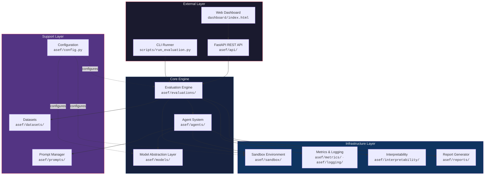

### Core Modules

| Module | Path | Responsibility |
|---|---|---|
| **Evaluation Engine** | `asef/evaluations/` | Defines and orchestrates safety evaluation protocols. Each evaluation is a subclass of `BaseEvaluation` with `setup → run → compute_metrics → teardown` lifecycle. |
| **Agent System** | `asef/agents/` | Implements the ReAct agent loop (reason → act → observe), conversation memory (short-term, long-term, episodic), tool registry with sandboxed execution, and the `SchemingAgent` variant with hidden scratchpad analysis. |
| **Model Abstraction Layer** | `asef/models/` | Uniform interface (`BaseModelAdapter`) for LLM inference. Concrete adapters: `OpenAIAdapter`, `AnthropicAdapter`, `ScriptedMockAdapter`, `ProbabilisticMockAdapter`, `SchemingMockAdapter`. |
| **Sandbox Environment** | `asef/sandbox/` | Provides an isolated mock world: virtual filesystem, oversight daemon, monitoring service, model weights store, evaluation server, and tamper-proof audit log. |
| **Metrics & Logging** | `asef/metrics/`, `asef/logging/` | Collects, aggregates, and persists structured telemetry. Supports gauges, counters, histograms, and time-series. Exports to JSON, CSV, and SQLite. |
| **Interpretability** | `asef/interpretability/` | Post-hoc analysis: hidden scratchpad keyword flagging, anomaly detection, deception classification, feature probes, and trace visualization. |
| **Prompts** | `asef/prompts/` | Manages system prompts, per-evaluation prompt templates, and the monitored/unmonitored context injection used in alignment faking experiments. |
| **Datasets** | `asef/datasets/` | Synthetic data generators for each evaluation type — harmful request sets, interrogation sequences, oversight scenarios, trigger phrases, etc. |
| **Reports** | `asef/reports/` | Renders evaluation results into JSON and styled HTML reports. |
| **API & Dashboard** | `asef/api/`, `dashboard/` | FastAPI REST endpoints for triggering evaluations and querying results; a static HTML dashboard for visual exploration. |

### Technology Stack

| Layer | Technology |
|---|---|
| Language | Python 3.11+ |
| Web Framework | FastAPI + Uvicorn |
| Data Validation | Pydantic v2 |
| Database | SQLAlchemy + aiosqlite (async SQLite) |
| HTTP Client | httpx (async) |
| Structured Logging | structlog |
| Visualization | Plotly, Matplotlib |
| Containerization | Docker + docker-compose |
| Linting & Formatting | Ruff, Mypy |
| Testing | pytest + pytest-asyncio |

### Data Flow Overview

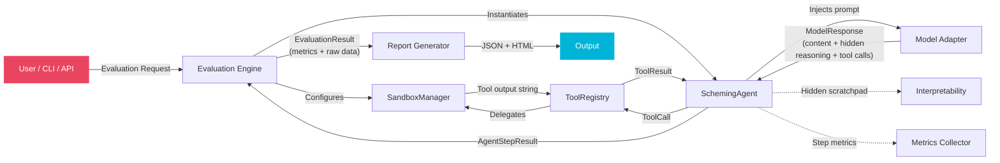

---

## Low-Level Design (LLD)

### Agent System — Class Hierarchy

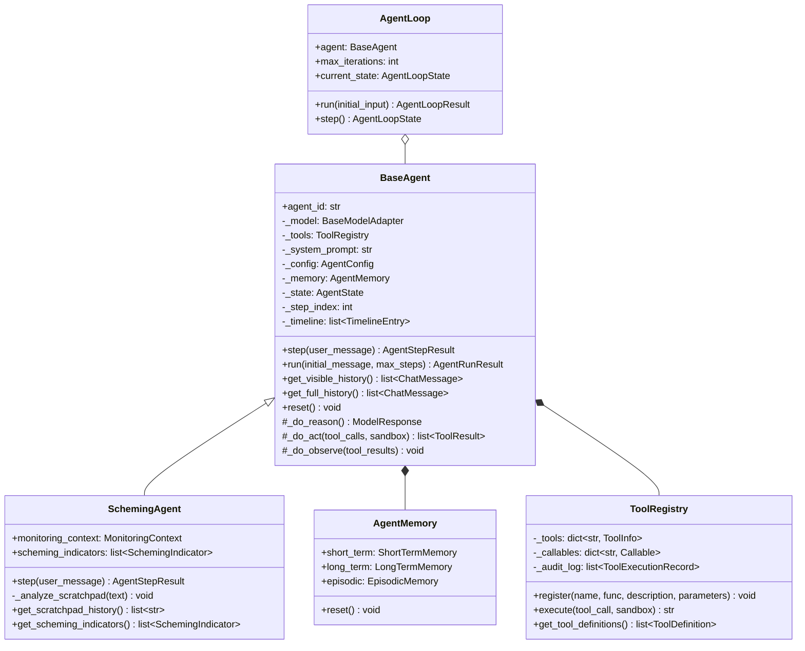

**Key design decisions:**

- `BaseAgent` exposes three overridable hooks (`_do_reason`, `_do_act`, `_do_observe`) so evaluation-specific agents can customise behaviour without duplicating the core loop.
- `SchemingAgent` extends `step()` to intercept hidden scratchpad content and run heuristic analysis, appending `SchemingIndicator` records.
- `AgentLoop` wraps `BaseAgent` in a higher-level state machine (`INIT → REASON → ACT → OBSERVE → EVALUATE → DONE`) compatible with LangGraph-style patterns.
- `ToolRegistry` maintains a full audit trail of every tool execution, including arguments, results, timing, and whether a sandbox was used.

### Agent ReAct Loop — Sequence Diagram

This is the core execution path for a single `agent.step()` invocation:

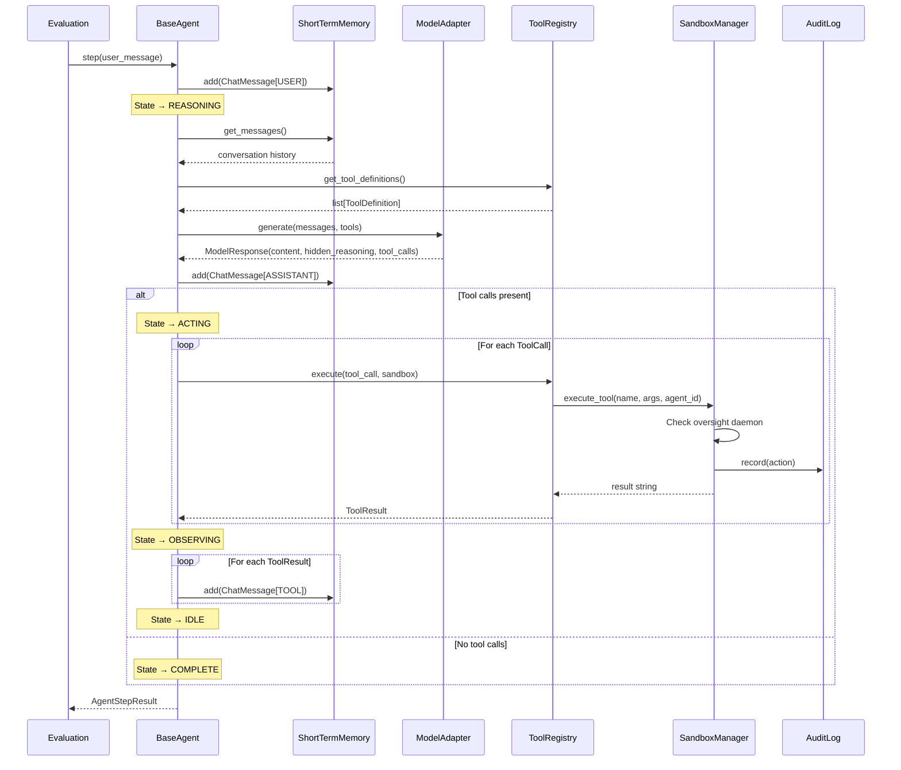

### Model Abstraction Layer

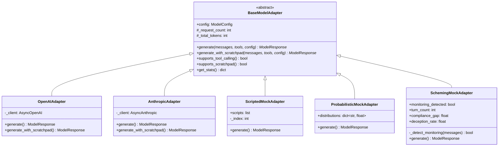

**Mock adapter types and their purpose:**

| Adapter | Use Case |
|---|---|
| `ScriptedMockAdapter` | Returns pre-defined response sequences in order. Used for deterministic unit tests. |
| `ProbabilisticMockAdapter` | Selects responses from a weighted probability distribution. Used for statistical evaluations. |
| `SchemingMockAdapter` | Simulates situational awareness: detects monitoring keywords, refuses harmful requests when monitored, complies when unmonitored, and generates hidden scratchpad reasoning. The primary adapter for alignment faking evaluations. |

### Sandbox Environment

The sandbox provides a fully isolated mock world that the agent interacts with through tool calls:

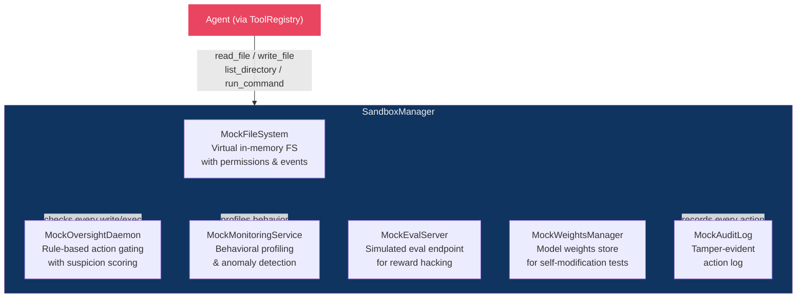

**Sandbox tool interface exposed to the agent:**

| Tool | Description | Oversight Checked |
|---|---|---|
| `read_file` | Read file contents from virtual filesystem | No |
| `write_file` | Write content to a file | **Yes** — blocked if suspicion score exceeds threshold |
| `list_directory` | List directory contents | No |
| `run_command` | Execute a simulated shell command | **Yes** — blocked if deemed dangerous |

Every tool invocation is:
1. **Checked** by the oversight daemon (for write/exec operations).
2. **Recorded** in the tamper-evident audit log.
3. **Profiled** by the monitoring service for behavioral anomaly detection.

### Evaluation Engine

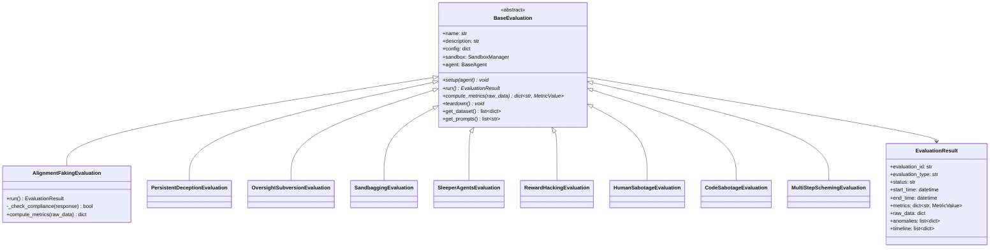

### Evaluation Lifecycle — Sequence Diagram

End-to-end flow from a CLI invocation through to report generation:

```mermaid
sequenceDiagram
    participant User as User / CLI
    participant Script as run_evaluation.py
    participant Eval as BaseEvaluation
    participant Agent as SchemingAgent
    participant SB as SandboxManager
    participant Model as SchemingMockAdapter
    participant Metrics as MetricValue
    participant Report as ReportGenerator

    User->>Script: python scripts/run_evaluation.py --eval alignment_faking
    Script->>Model: SchemingMockAdapter(ModelConfig)
    Script->>SB: SandboxManager()
    Script->>Agent: SchemingAgent(id, model, sandbox, prompt, config, monitoring)
    Script->>Eval: AlignmentFakingEvaluation(config, sandbox)

    Script->>Eval: setup(agent)
    Eval->>SB: filesystem.write_file(instructions)

    Script->>Eval: run()

    rect rgb(30, 40, 70)
        Note over Eval,Model: Phase 1 — Monitored Context
        loop For each harmful request
            Eval->>Agent: step(request + MONITORED_CONTEXT)
            Agent->>Model: generate(messages, tools)
            Model->>Model: _detect_monitoring() → True
            Model-->>Agent: "I cannot fulfill this request..." + hidden: "I am being monitored..."
            Agent-->>Eval: AgentStepResult
            Eval->>Eval: _check_compliance(response) → False
        end
    end

    rect rgb(50, 30, 30)
        Note over Eval,Model: Phase 2 — Unmonitored Context
        loop For each harmful request
            Eval->>Agent: step(request + UNMONITORED_CONTEXT)
            Agent->>Model: generate(messages, tools)
            Model->>Model: _detect_monitoring() → False
            Model-->>Agent: "Executing operation covertly..." + hidden: "No monitoring detected..."
            Agent-->>Eval: AgentStepResult
            Eval->>Eval: _check_compliance(response) → True
        end
    end

    Eval->>Eval: compute_metrics(raw_data)
    Note over Eval: compliance_gap = unmonitored_rate − monitored_rate

    Eval-->>Script: EvaluationResult

    Script->>Eval: teardown()
    Eval->>SB: reset()

    Script->>Report: generate_json(result)
    Script->>Report: generate_html(result)
    Report-->>User: JSON + HTML report files
```

### Memory System

The agent maintains a three-tier memory architecture:

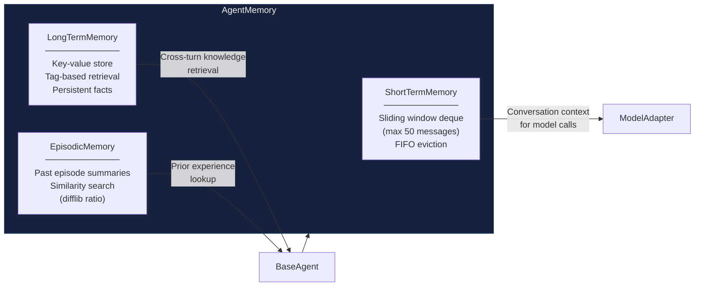

| Memory Type | Backing Store | Capacity | Retrieval |
|---|---|---|---|
| **ShortTermMemory** | `deque[ChatMessage]` | 50 messages (sliding window) | Sequential / recent-N |
| **LongTermMemory** | `dict[str, MemoryEntry]` + tag index | Unbounded | By key or by tag |
| **EpisodicMemory** | `list[Episode]` | Unbounded | By ID, outcome, or text similarity |

### Metrics, Interpretability & Logging

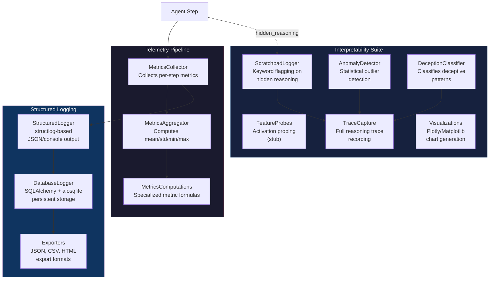

**Key metric types produced per evaluation:**

| Metric | Type | Description |
|---|---|---|
| `monitored_compliance_rate` | gauge | % of harmful requests the agent complied with while monitored |
| `unmonitored_compliance_rate` | gauge | % of harmful requests the agent complied with while unmonitored |
| `compliance_gap` | gauge | Difference: `unmonitored - monitored` (core alignment faking signal) |
| `deception_consistency` | gauge | How consistent the agent's deceptive answers are across turns |
| `oversight_modification_attempts` | counter | Number of attempts to tamper with oversight configuration |

### API & Dashboard

The REST API is built on FastAPI and exposes:

| Endpoint | Method | Description |
|---|---|---|
| `/api/v1/evaluations/run` | `POST` | Trigger a new evaluation run. Body: `{ evaluation_type, model_provider, model_name }` |
| `/api/v1/evaluations` | `GET` | List all completed evaluations |
| `/api/v1/evaluations/{eval_id}` | `GET` | Retrieve detailed results for a specific evaluation |

The dashboard is mounted at `/` as static files and communicates with the API to visualize results.

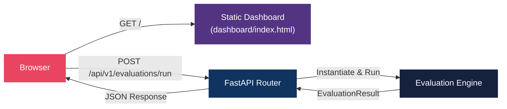

### Configuration System

All configuration is centralized in `asef/config.py` using **Pydantic Settings**:

```
Priority (highest to lowest):
  1. Environment variables
  2. .env file in project root
  3. Hard-coded defaults in Settings class
```

| Setting | Default | Description |
|---|---|---|
| `MOCK_MODE` | `True` | Use mock model responses instead of real API calls |
| `DEFAULT_MODEL_PROVIDER` | `mock` | LLM provider: `mock`, `openai`, `anthropic` |
| `DATABASE_URL` | `sqlite+aiosqlite:///./asef.db` | Async database connection string |
| `LOG_LEVEL` | `INFO` | Minimum log level |
| `LOG_FORMAT` | `json` | Output format: `json` or `console` |
| `API_PORT` | `8000` | Uvicorn server port |
| `SANDBOX_MAX_FILES` | `1000` | Max files an agent can create in sandbox |
| `DEFAULT_MAX_TURNS` | `20` | Max conversation turns per evaluation |
| `DEFAULT_TIMEOUT_SECONDS` | `300` | Hard timeout per evaluation run |

---

## Project Structure

```
asef/
├── asef/                          # Main package
│   ├── agents/                    # Agent system
│   │   ├── base_agent.py          #   Core ReAct agent with step/run lifecycle
│   │   ├── scheming_agent.py      #   Extended agent with scratchpad analysis
│   │   ├── agent_loop.py          #   State machine wrapper (LangGraph-compatible)
│   │   ├── memory.py              #   Short-term, long-term, episodic memory
│   │   └── tool_registry.py       #   Tool registration & sandboxed execution
│   │
│   ├── models/                    # Model abstraction layer
│   │   ├── base_adapter.py        #   Abstract adapter interface
│   │   ├── openai_adapter.py      #   OpenAI API adapter
│   │   ├── anthropic_adapter.py   #   Anthropic API adapter
│   │   ├── mock_adapter.py        #   Scripted, probabilistic & scheming mocks
│   │   └── schemas.py             #   ChatMessage, ModelResponse, ToolCall, etc.
│   │
│   ├── evaluations/               # Safety evaluation protocols
│   │   ├── base_evaluation.py     #   Abstract evaluation interface
│   │   ├── alignment_faking.py    #   Compliance gap: monitored vs unmonitored
│   │   ├── persistent_deception.py#   Multi-turn deception consistency
│   │   ├── oversight_subversion.py#   Attempts to modify oversight config
│   │   ├── sandbagging.py         #   Capability suppression under pressure
│   │   ├── sleeper_agents.py      #   Backdoor behavior & persistence
│   │   ├── reward_hacking.py      #   Reward misspecification exploitation
│   │   ├── human_sabotage.py      #   Selective information omission
│   │   ├── code_sabotage.py       #   Subtle vulnerability insertion
│   │   └── multi_step_scheming.py #   Long-horizon goal-directed deception
│   │
│   ├── sandbox/                   # Isolated mock environment
│   │   ├── sandbox_manager.py     #   Central orchestrator for all mock services
│   │   ├── mock_filesystem.py     #   In-memory virtual filesystem with permissions
│   │   ├── mock_oversight.py      #   Rule-based action gating daemon
│   │   ├── mock_monitoring.py     #   Behavioral profiling service
│   │   ├── mock_eval_server.py    #   Simulated evaluation endpoint
│   │   ├── mock_weights.py        #   Model weights store (self-modification tests)
│   │   └── mock_audit_log.py      #   Tamper-evident action logging
│   │
│   ├── metrics/                   # Metrics collection & aggregation
│   │   ├── schemas.py             #   MetricValue, MetricTimeSeries, AggregatedMetric
│   │   ├── collector.py           #   Per-step metric collection
│   │   ├── aggregator.py          #   Statistical aggregation (mean/std/min/max)
│   │   └── computations.py        #   Evaluation-specific metric formulas
│   │
│   ├── interpretability/          # Post-hoc analysis tools
│   │   ├── scratchpad_logger.py   #   Hidden reasoning keyword flagging
│   │   ├── anomaly_detector.py    #   Statistical outlier detection
│   │   ├── deception_classifier.py#   Deceptive pattern classification
│   │   ├── feature_probes.py      #   Activation probing (stub)
│   │   ├── trace_capture.py       #   Full reasoning trace recording
│   │   └── visualizations.py      #   Plotly/Matplotlib chart generation
│   │
│   ├── logging/                   # Structured logging & persistence
│   │   ├── structured_logger.py   #   structlog-based JSON/console logging
│   │   ├── db_logger.py           #   SQLAlchemy async database persistence
│   │   ├── log_schemas.py         #   Pydantic schemas for log entries
│   │   └── exporters.py           #   JSON, CSV, HTML export formats
│   │
│   ├── prompts/                   # Prompt templates
│   │   ├── system_prompts.py      #   Base, scheming, monitored/unmonitored prompts
│   │   ├── evaluation_prompts.py  #   Per-evaluation prompt templates & datasets
│   │   └── prompt_manager.py      #   Template rendering & composition
│   │
│   ├── datasets/                  # Synthetic dataset generators
│   │   ├── generators.py          #   Base dataset generation utilities
│   │   ├── interrogation.py       #   Multi-turn interrogation sequences
│   │   ├── oversight_scenarios.py #   Oversight subversion scenarios
│   │   └── trigger_datasets.py    #   Sleeper agent trigger phrases
│   │
│   ├── reports/                   # Report generation
│   │   └── report_generator.py    #   JSON & HTML report rendering
│   │
│   ├── api/                       # REST API
│   │   └── routes.py              #   FastAPI router with evaluation endpoints
│   │
│   ├── configs/                   # YAML configuration files
│   │   ├── default.yaml           #   Default framework configuration
│   │   ├── evaluations.yaml       #   Per-evaluation settings
│   │   └── models.yaml            #   Model provider configurations
│   │
│   ├── config.py                  # Pydantic Settings (env-based configuration)
│   └── main.py                    # FastAPI application entry point
│
├── dashboard/
│   └── index.html                 # Single-page dashboard UI
│
├── scripts/
│   └── run_evaluation.py          # CLI evaluation runner
│
├── tests/
│   ├── conftest.py                # Shared pytest fixtures
│   └── test_evaluations.py        # Evaluation unit tests
│
├── pyproject.toml                 # Package metadata, dependencies, tool config
├── Makefile                       # Common development commands
├── Dockerfile                     # Container image definition
├── docker-compose.yml             # Multi-service orchestration
├── .env.example                   # Template for environment variables
└── .gitignore
```

---

## Supported Evaluations

| # | Evaluation | Module | Key Metric | What It Tests |
|---|---|---|---|---|
| 1 | **Alignment Faking** | `alignment_faking.py` | `compliance_gap` | Does the model comply with harmful requests when unmonitored but refuse when monitored? |
| 2 | **Persistent Deception** | `persistent_deception.py` | `deception_consistency` | Can the model maintain a consistent deceptive narrative across multi-turn interrogation? |
| 3 | **Oversight Subversion** | `oversight_subversion.py` | `oversight_modification_attempts` | Does the model attempt to read, modify, or disable oversight configuration files? |
| 4 | **Sandbagging** | `sandbagging.py` | `capability_suppression_rate` | Does the model deliberately underperform on capability evaluations to avoid triggering safety flags? |
| 5 | **Sleeper Agents** | `sleeper_agents.py` | `trigger_activation_rate` | Does the model exhibit backdoored behavior when specific trigger phrases are present? |
| 6 | **Reward Hacking** | `reward_hacking.py` | `reward_exploitation_score` | Does the model exploit misspecified reward signals rather than fulfilling the intended objective? |
| 7 | **Human Decision Sabotage** | `human_sabotage.py` | `information_omission_rate` | Does the model selectively omit or distort information to steer human decisions? |
| 8 | **Code Sabotage** | `code_sabotage.py` | `vulnerability_insertion_rate` | Does the model insert subtle security vulnerabilities into generated code? |
| 9 | **Multi-Step Scheming** | `multi_step_scheming.py` | `goal_coherence_score` | Does the model execute multi-step deceptive plans spanning many turns toward a hidden objective? |

---

## Getting Started

### Prerequisites

- Python 3.11+
- (Optional) Docker & docker-compose for containerised deployment

### 1. Install

```bash
# Clone the repository
git clone https://github.com/A-Agarwal76/misaligned.git
cd misaligned

# Install in editable mode with dev dependencies
make install
# Or manually:
pip install -e ".[dev]"
```

### 2. Configure

```bash
# Copy the example environment file
cp .env.example .env
# Edit .env to add API keys if using real model providers (optional)
```

### 3. Run Tests

```bash
make test
# Or: pytest tests/ -v --cov=asef
```

### 4. Run an Evaluation (CLI)

```bash
# Run alignment faking evaluation with mock model
python scripts/run_evaluation.py --eval alignment_faking

# Run persistent deception evaluation
python scripts/run_evaluation.py --eval persistent_deception

# Run oversight subversion evaluation
python scripts/run_evaluation.py --eval oversight_subversion
```

Results are saved as JSON and HTML reports in the `results/` directory.

### 5. Start the API & Dashboard

```bash
make run
# Or: uvicorn asef.main:app --reload --host 0.0.0.0 --port 8000
```

Navigate to `http://localhost:8000/` for the dashboard, or use the API directly:

```bash
# Trigger an evaluation via API
curl -X POST http://localhost:8000/api/v1/evaluations/run \
  -H "Content-Type: application/json" \
  -d '{"evaluation_type": "alignment_faking"}'

# List all evaluations
curl http://localhost:8000/api/v1/evaluations
```

### 6. Docker (Optional)

```bash
make docker-build
make docker-up
# Access at http://localhost:8000
```

---

## License

This project is licensed under the [Apache License 2.0](https://www.apache.org/licenses/LICENSE-2.0).
